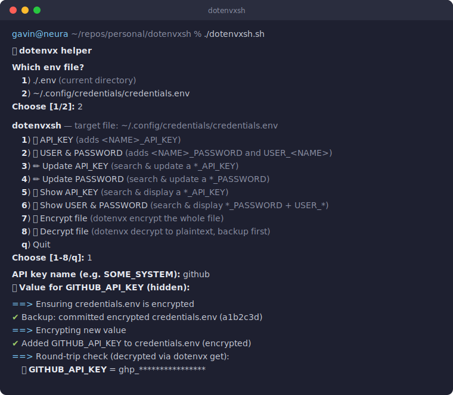

# 🔐 dotenvxsh

Shell helper for faster processing of [dotenvx](https://dotenvx.com) files.

A small TUI script for adding, updating, and viewing secrets in dotenvx-encrypted
`.env` files — with automatic encryption, git-commit backups before every change,
and decrypted round-trip verification after every write.



> 🤖 **AI agents:** the TUI is interactive-only — see [AGENTS.md](AGENTS.md)
> for non-interactive equivalents, the naming schema, and safety rules.

## Prerequisites

- **[dotenvx](https://dotenvx.com)** — the encrypted `.env` toolkit this script drives.
  Download from [dotenvx.com](https://dotenvx.com) or [github.com/dotenvx/dotenvx](https://github.com/dotenvx/dotenvx):

  ```sh
  # macOS (Homebrew)
  brew install dotenvx/brew/dotenvx

  # or the install script
  curl -sfS https://dotenvx.com/install.sh | sh
  ```

- **bash** ≥ 3.2 (works with the stock macOS bash) and standard Unix tools.
- **git** *(optional)* — when the target env file lives inside a git repository,
  pre-change backups are taken as commits; otherwise a timestamped `.bak` copy
  is made next to the file.

## Installation

```sh
git clone https://github.com/GavinTomlins/dotenvxsh.git
cd dotenvxsh
chmod +x dotenvxsh.sh
```

Optionally symlink it onto your `PATH`:

```sh
ln -s "$PWD/dotenvxsh.sh" /usr/local/bin/dotenvxsh
```

## Usage

```sh
./dotenvxsh.sh               # interactive file picker
./dotenvxsh.sh path/to/.env  # target a specific file, skipping the picker
```

With no argument, the script first asks which env file to work on:

```
Which env file?
  1) ./.env (current directory)
  2) ~/.config/credentials/credentials.env
```

### Local and global configuration

dotenvxsh works with two kinds of env file, chosen in the picker above:

- **Local (`./.env`)** — a per-project file in the current directory. Use it
  for secrets that belong to one project (its database password, its service
  tokens). The encrypted file can be committed alongside the project's code;
  only the `.env.keys` private key must stay out of the repository.
- **Global** — a single machine-wide credentials vault, by default
  `~/.config/credentials/credentials.env`. Use it for personal credentials you
  reach for across many projects (your GitHub token, registrar API keys,
  logins). It is created automatically the first time you select it.

The same secret can live in both: a project `.env` for what the project needs,
the global vault for what *you* need everywhere.

#### Configuring the global credentials file

The default location is `~/.config/credentials/credentials.env`. To use a
different path — for example `~/.config/credentials.env` — set
`DOTENVXSH_CREDENTIALS_FILE` in your shell profile (`~/.zshrc` / `~/.bashrc`):

```sh
export DOTENVXSH_CREDENTIALS_FILE="$HOME/.config/credentials.env"
```

Picker option 2 then offers that path instead. For a one-off file, skip the
picker entirely and pass any path as the first argument:

```sh
./dotenvxsh.sh ~/work/secrets/staging.env
```

#### Setting up the global vault (recommended)

To get commit-based backups for the global vault, make its directory a git
repository before first use:

```sh
mkdir -p ~/.config/credentials
cd ~/.config/credentials
git init
printf '.env.keys\n*.bak\n' > .gitignore
```

Every change dotenvxsh makes will then be preceded by a commit of the
encrypted file in this repository, giving you a full history to roll back to.
Without git, dotenvxsh falls back to timestamped `.bak` copies next to the
file. Either way, keep `.env.keys` out of any repository.

Consume the global vault from anywhere — dotenvx finds the private key in the
`.env.keys` file next to the vault, regardless of your current directory:

```sh
dotenvx run -f ~/.config/credentials/credentials.env -- some-command
```

### Menu

```
  1) 🔑 API_KEY          (adds <NAME>_API_KEY)
  2) 👤 USER & PASSWORD  (adds <NAME>_PASSWORD and USER_<NAME>)
  3) ✏️ Update API_KEY   (search & update a *_API_KEY)
  4) ✏️ Update PASSWORD  (search & update a *_PASSWORD)
  5) 🔍 Show API_KEY     (search & display a *_API_KEY)
  6) 🔍 Show USER & PASSWORD (search & display *_PASSWORD + USER_*)
  7) 🔒 Encrypt file     (dotenvx encrypt the whole file)
  8) 🔓 Decrypt file     (dotenvx decrypt to plaintext, backup first)
  q) Quit
```

**1 — Add an API key.** Prompts for a name and builds `<NAME>_API_KEY`
(input is uppercased, and anything that isn't a letter, digit, or underscore
becomes an underscore — `some system` → `SOME_SYSTEM_API_KEY`). The value is
entered hidden.

**2 — Add a user & password pair.** One name produces both variables:
`<NAME>_PASSWORD` and `USER_<NAME>` (e.g. `AIHUB` → `AIHUB_PASSWORD` and
`USER_AIHUB`). If one half of the pair already exists, it is skipped and the
other is still added.

**3 / 4 — Update.** Type a search term (case-insensitive substring — `gitlab`
finds `GITLAB_API_KEY` and `GITLAB_CI_API_KEY`). A single hit goes straight to
the hidden value prompt; multiple hits are presented as a numbered picker.
Every step can be cancelled: empty search input, `c` in the picker, or an empty
value all abort with the file untouched.

**5 / 6 — Show.** Same search flow, then the value is decrypted with
`dotenvx get` and printed. Option 6 collapses `USER_FOO` / `FOO_PASSWORD`
matches into one logical credential and displays both halves of the pair,
warning if either half is missing.

**7 — Encrypt file.** Runs `dotenvx encrypt` on the selected file. Idempotent:
plaintext values are encrypted, already-encrypted values are left untouched,
so it is always safe to run.

**8 — Decrypt file.** Writes decrypted plaintext back to the selected file —
useful for bulk edits. Because this leaves secrets readable on disk, it warns
first and requires an explicit `y` to proceed, and it backs up the fully
encrypted state (git commit or `.bak` copy) before decrypting. Re-encrypt with
option 7 when you are done.

### What happens on every write

1. **Duplicate check** — a key that already exists is never re-added.
2. **Encrypt** — `dotenvx encrypt` runs first, so the file is fully encrypted
   before anything else touches it.
3. **Backup** — the encrypted file is committed to git (or copied to a
   timestamped `.bak` when not in a repository).
4. **Write** — the new value is appended (or set, for updates) and encrypted.
5. **Round-trip check** — the value is decrypted with `dotenvx get` and echoed
   back so you can confirm it stored correctly.

No manual decryption is ever needed: dotenvx uses public-key encryption, so
new values are encrypted with the `DOTENV_PUBLIC_KEY` already in the file.

### Consuming the secrets

```sh
# inject decrypted values straight into a command's environment
dotenvx run -f ~/.config/credentials/credentials.env -- some-command

# read a single value
dotenvx get GITHUB_API_KEY -f ~/.config/credentials/credentials.env
```

## Security notes

- `dotenvx encrypt` writes the private decryption key to `.env.keys` beside the
  env file. **Never commit `.env.keys`** — this repository's `.gitignore`
  excludes it, and the script's backup commits only ever include the env file
  itself.
- The round-trip check and the show options print decrypted secrets to your
  terminal (and therefore scrollback). Avoid using them while screen-sharing.

## Changelog

Notable changes are tracked in human-readable form in
[CHANGELOG.md](CHANGELOG.md).

## License

[MIT](LICENSE)
